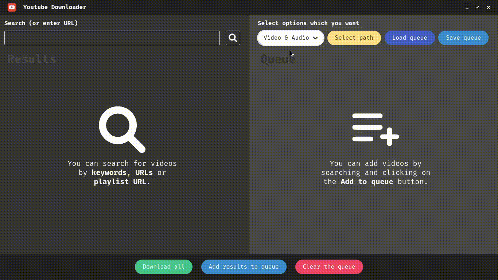

# Youtube Downloader

Simple youtube downloader which makes downloading youtube videos, high quality music from a playlist or by search results really easy. You don't need to use your browser to search for youtube links anymore or use any of the online services.

---

## Table of contents

* [Demo](#demo)
* [Installation](#installation)
* [Features](#features)
* [Technologies](#technologies)
* [Development setup](#development-setup)
* [Buy me a coffee](#buy-me-a-coffee)
* [License](#license)

---

## Demo



---

## Installation

1. Download the [applicable installer or executable](https://github.com/GrzywN/Youtube-Downloader/releases/latest) for your system.
2. If you are on Windows, make sure that the [Microsoft Visual C++ 2010 Redistributable Package (x86)](https://download.microsoft.com/download/1/6/5/165255E7-1014-4D0A-B094-B6A430A6BFFC/vcredist_x86.exe) is installed. 

---

## Features

- Searching for results based on user input (Single video, search query or whole playlist).

- Downloading single videos or whole queue in the highest quality available in mp4 and mp3 formats.

- Changing path where you download your files.

- Saving and loading JSON queue files. (Possible streaming services integration in the future)

- Tracking downloading process

### To do:

- Make videos download one by one

- Add `More results` button or arrow navigation buttons for loading more results

- Add buttons to cancel or pause downloading

- Add Spotify integration with loading queue

- Add light theme and integrate it with system preferences

- Add `Open file` and `Show File in folder`buttons after a file is downloaded

- Improve security and performance (Electron IPC, nodeIntegration)

- Improve file handling``

---

## Technologies

- Electron 19.0.4

- Node.js v16.16.0

- HTML5 & CSS3

- Bulma v0.9.4

- ytdl-core, ytpl, ytsr, fluent-ffmpeg

- Vitest ^0.18.0

- ESLint, Prettier

---

## Development setup

To clone and run this application, you'll need [Git](https://git-scm.com) and [Node.js](https://nodejs.org/en/download/) (which comes with [npm](http://npmjs.com)) installed on your computer. From your command line:

```bash
# Clone this repository
$ git clone https://github.com/GrzywN/Youtube-Downloader.git

# Go into the repository
$ cd Youtube-Downloader

# Install dependencies
$ npm install

# Run the app
$ npm start
```

---

## Build for your own operating system

To build the application for your own operating system, you'll need to setup development enviroment and run `npm build` command. 

---

## Buy me a coffee

Whether you use this project, have learned something from it, or just like it, please consider supporting it by buying me a coffee, so I can dedicate more time on open-source projects like this :)

[](https://www.buymeacoffee.com/grzywn)

---

## License

[MIT](https://choosealicense.com/licenses/mit/)
